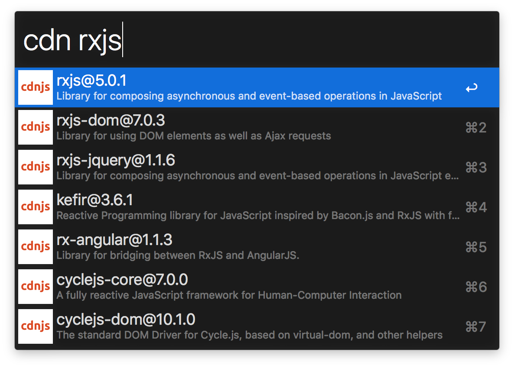

# alfred-cdnjs

[Alfred 3](https://www.alfredapp.com/) workflow to search libs on [cdnjs](https://cdnjs.com/)



## Install

```
$ npm install -g alfred-cdnjs
```

## Usage

In Alfred, type `cdn`, <kbd>Enter</kbd> and type library name to search.

Select library and press <kbd>Enter</kbd> to copy latest library url in your clipboard. Hold <kbd>Alt</kbd> when pressing <kbd>Enter</kbd> to open its cdnjs page.
